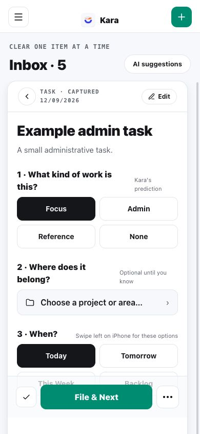
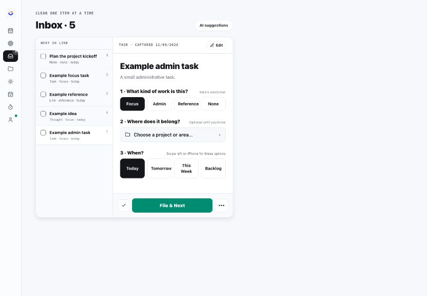

The approved Today and Inbox direction is now available on iPhone and iPad.

- **Today has Morning, Active day, and Closing** on one surface, with a dedicated moment control.
- **iPhone gets a proper top-left menu** for the main Kara navigation.
- **Inbox becomes a direct decision flow** with work kind, project or area, timing, editing, completion, and File & Next.
- **Native phone swipes speed up cleanup:** timing on the left; file, defer, and delete on the right.
- **Closing shows the Inbox count** and opens it directly, so the remaining cleanup is always visible.

